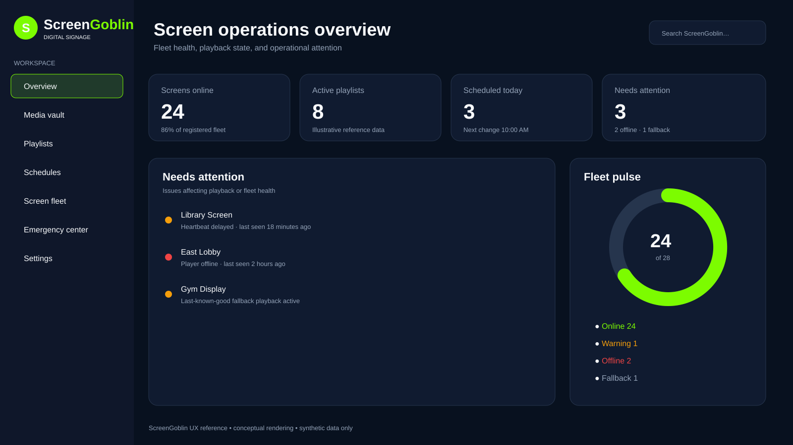
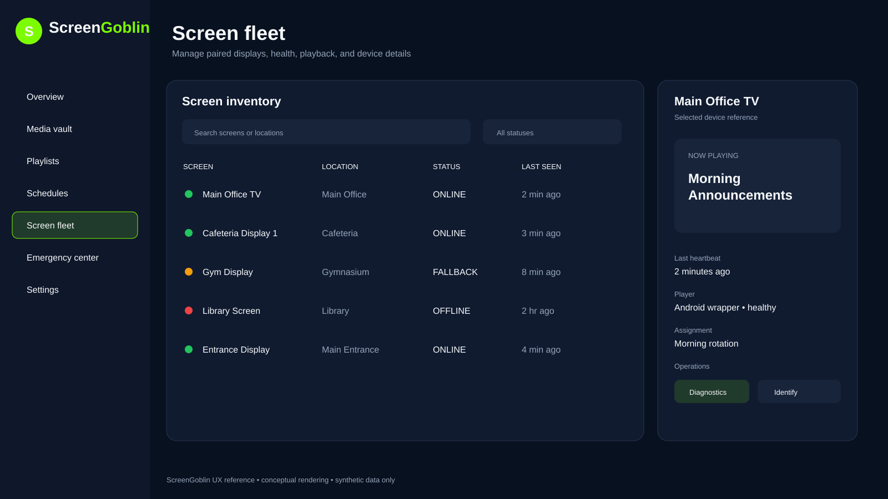
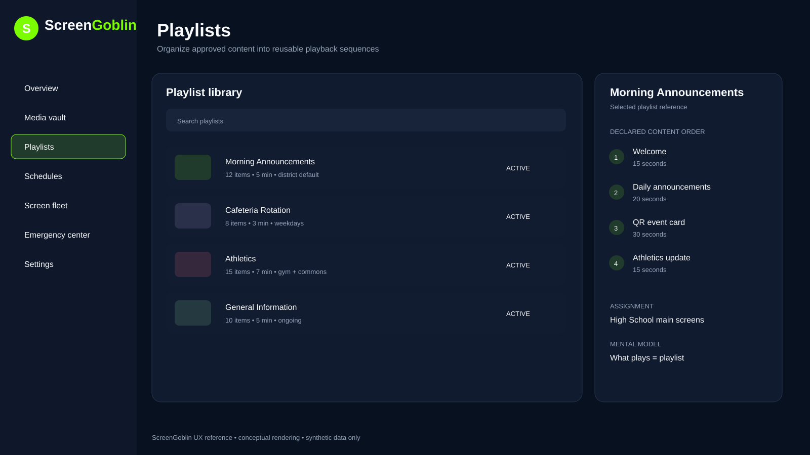
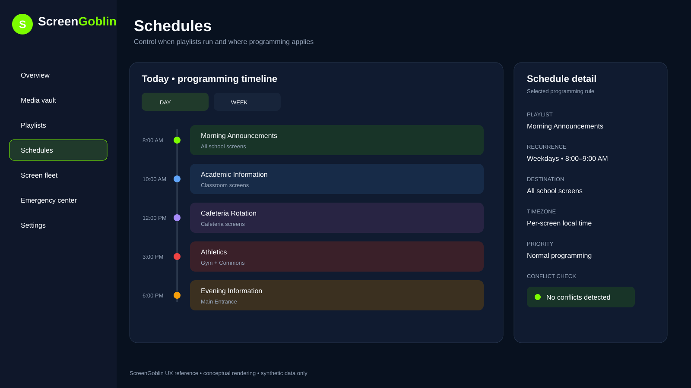

# ScreenGoblin UX reference

These version-controlled SVG renderings are the approved ScreenGoblin visual references for future Console work. They replace the earlier binary concepts in `packages/brand/reference/` and are intentionally stored as SVG so GitHub and text-oriented development tools can review and modify them directly.

> **Reference only:** these are conceptual renderings with synthetic data. They are not screenshots of deployed functionality and do not prove that a pictured control or workflow is implemented.

## Approved renderings

### Operations dashboard

Fleet health, playback state, screens needing attention, and an operational fleet pulse.

### Screen fleet

Display inventory, health status, last-seen state, current playback, assignment information, and bounded device-management affordances.

### Playlists

Reusable content rotations, ordered items, durations, assignment context, and the explicit **what plays = playlist** model.

### Schedules

Daily programming timeline, recurring rules, destinations, timezone behavior, priority, and conflict status. This preserves **where it plays = screen/group/location** and **when it plays = schedule**.

## Design direction

- Professional, dark-first ScreenGoblin operations interface.
- ScreenGoblin green as the principal accent with midnight/charcoal surfaces.
- Information-dense but readable layouts with compact left navigation.
- Status communicated with text/icons as well as color.
- Operational health and recovery information prioritized over decorative analytics.
- Responsive behavior suitable for desktop administration and smaller management displays.
- Synthetic/generic labels in reference art; never place school-specific infrastructure, credentials, PII, private URLs, or production data in screenshots or renderings.

`packages/brand/src/tokens.json` remains the code-facing source of truth for exact colors, typography, spacing, and component tokens. These renderings establish layout, hierarchy, workflow, and visual direction; they do not override accessibility, security, safety, tests, or implemented product behavior.

## Implementation rules

When implementing or reviewing ScreenGoblin UI work:

- use these ScreenGoblin SVGs as the preferred visual/layout reference;
- do **not** use Herd Store, LabGoblin, RoomGoblin, PatchGoblin, or unrelated project imagery as a ScreenGoblin reference;
- keep fleet health, offline/fallback state, last-seen information, and recovery-relevant details prominent;
- keep unsupported prototype controls hidden or visibly disabled;
- never silently substitute demo data after live-data failure;
- preserve precise operational and security copy;
- keep emergency functionality isolated and disabled until the repository's pre-production emergency gates are satisfied;
- treat AI as assistive only and never allow it to publish, activate emergency behavior, or issue destructive device commands autonomously.

## Asset format

The authoritative reference files are:

- `packages/brand/reference/01-dashboard.svg`
- `packages/brand/reference/02-screen-fleet.svg`
- `packages/brand/reference/03-playlists.svg`
- `packages/brand/reference/04-schedules.svg`

SVG is used here specifically as a version-controlled design/reference format. This does **not** change ScreenGoblin's player media policy: SVG/web content remains unsupported for signage playback unless its separate media-security design gate is implemented and approved.
