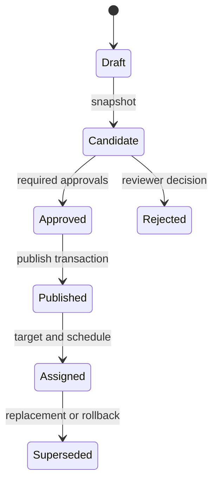

# Scoped authorization and immutable release plan

## Status

**Design proposal — not fully implemented or approved.** Ordinary release publication and withdrawal now use a closed, deny-by-default capability adapter backed by current organization membership, while preserving the existing role behavior. The broader API still uses one organization membership role (`OWNER`, `ADMIN`, `PUBLISHER`, or `VIEWER`) and organization-filtered queries. That is insufficient for least-privilege multi-location publishing. Resource scopes, grants, approvals, policy review, backfill evidence, and full enforcement tests remain release gates.

Emergency publishing remains disabled. Nothing in this document authorizes emergency use or allows AI/automation to approve or publish content.

## Security outcomes

- Every decision derives the organization from the authenticated principal, never solely from caller input or an object ID.
- Authority is an explicit capability applied to a bounded resource scope; broad roles are convenient grant bundles, not authorization shortcuts.
- References between tenant-owned rows are enforced by database constraints as well as application policy.
- Editing cannot mutate what was approved or published. Devices receive only immutable, auditable published releases.
- Retried mutations are idempotent and mutation plus audit/outbox writes commit or fail together.
- A staged shadow/enforced rollout detects policy drift without silently broadening existing access.

## Capability vocabulary

Capabilities are stable strings checked server-side. The initial set should be deliberately small:

| Domain       | Capabilities                                                                                                             | Notes                                                                                                                                |
| ------------ | ------------------------------------------------------------------------------------------------------------------------ | ------------------------------------------------------------------------------------------------------------------------------------ |
| Organization | `org.read`, `org.manage`, `membership.read`, `membership.manage`, `audit.read`                                           | Membership management cannot grant capabilities the actor does not possess unless an explicit owner policy allows it                 |
| Screens      | `screen.read`, `screen.manage`, `screen.pair`, `screen.credential.revoke`                                                | Pairing and credential lifecycle are separate from ordinary screen edits                                                             |
| Content      | `media.read`, `media.create`, `media.delete`, `playlist.read`, `playlist.edit`                                           | Delete requires dependency and retention checks                                                                                      |
| Release      | `release.candidate.create`, `release.review`, `release.approve`, `release.publish`, `release.assign`, `release.rollback` | Approval and publish are independent capabilities; policy may require distinct people                                                |
| Schedule     | `schedule.read`, `schedule.edit`                                                                                         | Assignment/activation still requires release authority                                                                               |
| Fleet        | `fleet.health.read`, `device.command.propose`, `device.command.approve`, `device.update.manage`                          | Commands stay disabled until their separate protocol gate is complete                                                                |
| Emergency    | `emergency.propose`, `emergency.approve`, `emergency.activate`, `emergency.clear`                                        | Separate feature flag, MFA/re-auth, two-person policy, expiry, acknowledgements, and tabletop required before any grant is effective |

Unknown capabilities fail closed. Capabilities should be referenced through shared constants/contracts and validated at startup/migration, not assembled from arbitrary request strings.

## Default role bundles

| Current role | Proposed baseline bundle                                                                                     | Compatibility intent                                                                                          |
| ------------ | ------------------------------------------------------------------------------------------------------------ | ------------------------------------------------------------------------------------------------------------- |
| `OWNER`      | All non-emergency organization administration and release capabilities                                       | Existing owner remains able to administer its organization; sensitive operations still require re-auth/policy |
| `ADMIN`      | Membership/audit, screen lifecycle, fleet health, content and release management excluding owner-only grants | Preserve normal administration but remove implicit emergency authority                                        |
| `PUBLISHER`  | Content editing plus candidate/review/publish capabilities only within assigned scopes                       | No longer organization-wide after enforced scoped grants are established                                      |
| `VIEWER`     | Read-only content, schedule, screen, fleet health within assigned scopes                                     | No mutations                                                                                                  |

The migration must materialize explicit grants equivalent to intended existing access before enforcement. It must not infer emergency, destructive fleet, or cross-location authority from legacy roles.

## Resource scopes and grants

Use explicit hierarchical scopes with deterministic expansion:

| Scope type     | Meaning                                              | Matching behavior                                                                             |
| -------------- | ---------------------------------------------------- | --------------------------------------------------------------------------------------------- |
| `ORGANIZATION` | All current and future resources in one organization | Reserved for genuinely organization-wide duties                                               |
| `LOCATION`     | One approved location and resources attached to it   | Requires a first-class `Location` ID; never authorize from free-text `Screen.location`        |
| `SCREEN_GROUP` | Maintained collection of screens                     | Resolve membership transactionally at candidate/assignment time and snapshot exact screen IDs |
| `SCREEN`       | One screen                                           | Narrowest operational/publishing scope                                                        |

Proposed records:

- `RoleDefinition(organizationId, id, name, systemKey?, version)` maps organization-managed roles to capability strings.
- `AccessGrant(organizationId, id, subjectType, subjectId, roleDefinitionId or capability, scopeType, scopeId, startsAt?, expiresAt?, createdById, revokedAt?)`.
- `Location(organizationId, id, name, timezone, ...)`, `ScreenGroup(organizationId, id, name)`, and `ScreenGroupMember(organizationId, groupId, screenId)`.

Each tenant-owned table has a composite unique key containing both `id` and
`organizationId`. Foreign keys include `organizationId` and reference that
composite key, making cross-tenant linkage impossible even if application
validation regresses. In particular:

- `PairingCode(organizationId, screenId)` → `Screen(organizationId, id)`.
- `PlaylistItem(organizationId, playlistId, assetId)` → `Playlist` and `MediaAsset` in the same organization.
- `Schedule(organizationId, playlistId)` → `Playlist(organizationId, id)`.
- `ScheduleTarget(organizationId, scheduleId, screenId)` → same-organization `Schedule` and `Screen`.
- Release revision/item/assignment references described below use the same rule.

Migration sequence must add nullable tenant keys where necessary, backfill and verify zero mismatches/duplicates, add composite unique indexes, add constraints as `NOT VALID` where PostgreSQL permits, validate them, then make required fields non-null. Keep a rehearsed forward-fix/rollback plan; do not drop old constraints until compatible application versions are deployed.

The first composite-integrity migration implements these boundaries for playlist
items, schedules, schedule targets, and paired screens. `PairingCode` retains its
own required `organizationId` and uses a separate nullable
`screenOrganizationId` in the composite screen relation. A database check binds
the two organization values whenever a screen is linked. This deliberate extra
column allows `ON DELETE SET NULL` to detach both relation columns and preserve
pairing/audit history when a screen is deleted. The migration performs a
cross-tenant preflight before backfill and aborts rather than guessing ownership.
Because the new child ownership columns become required in the same migration,
deploy it with API writers stopped; mixed old/new API writers are not supported.
Database backup and restore verification remain required before applying it to
any environment containing non-test data.

## Policy evaluation

For each request, build a server-owned authorization context: principal ID/type, current organization membership, session/re-auth state, effective non-expired grants, requested capability, resolved resource organization/scope, feature flags, and request ID.

Decision rules:

1. Revalidate the user/device and organization membership; disabled, revoked, expired, or missing identity denies.
2. Load the resource under the authenticated organization boundary. Return the API's agreed non-enumerating result for inaccessible IDs.
3. Require an exact capability from an active grant whose scope contains the resource/target.
4. For target selectors, resolve every concrete screen and deny the whole mutation if any target is outside authority. Never partially broaden or silently drop unauthorized targets.
5. Apply separation-of-duty, re-authentication, conflict, accessibility, feature-flag, and release-state policies.
6. Emit a structured policy decision ID/reason for internal audit/metrics without leaking other tenant IDs or grant details to the caller.

The authorization library should expose one typed decision API used by route handlers and background jobs. Direct role comparisons remain only inside the compatibility adapter during migration and are banned in new business routes by review/lint convention.

## Immutable publishing model

### Records

| Record             | Purpose and immutability                                                                                                                                                         |
| ------------------ | -------------------------------------------------------------------------------------------------------------------------------------------------------------------------------- |
| `Playlist`         | Mutable editing container and current working metadata; never sent directly as published truth                                                                                   |
| `PlaylistRevision` | Immutable snapshot of ordered items, durations, accessibility metadata, asset digests, author, source playlist, and canonical revision digest                                    |
| `ReleaseCandidate` | Immutable proposal binding revision digest, resolved target snapshot, schedule/time zone, priority, policy/version results, creator, and expiry                                  |
| `Approval`         | Append-only decision binding candidate digest, approver, decision, capability/scope, policy version, comment/reason, and timestamp; revisions/targets invalidate prior approvals |
| `PublishedRelease` | Append-only publication of one approved candidate, manifest/release digest, publisher, signing key ID, compatibility bounds, and publication timestamp                           |
| `Assignment`       | Versioned append-only activation intent binding published release to concrete screen IDs and time window; replacement/clear creates another record rather than editing history   |

Database uniqueness should prevent duplicate revision digests per organization, multiple semantic publications for one candidate, duplicate approvals by the same required approval slot, and conflicting idempotency use. Published records must not cascade-delete with mutable drafts/media; retention uses explicit tombstone/archive policy while referenced immutable assets remain available.

### Publish transaction

Inside one PostgreSQL transaction at `SERIALIZABLE` or a justified locked isolation strategy:

1. Claim the idempotency key for organization + actor + operation and compare the canonical request hash on retries.
2. Lock/load candidate, approvals, source assets, target screens, policy version, and relevant active assignments under the tenant boundary.
3. Re-evaluate caller authority and all approval requirements; reject self-approval where separation of duty applies.
4. Verify revision/asset digests, target snapshot, schedule validity/conflicts, compatibility and accessibility policies.
5. Insert `PublishedRelease`, `Assignment` records, append-only `AuditEvent`, and transactional outbox event.
6. Commit once. Manifest generation/delivery consumes the outbox idempotently and records its result; it never invents authority.

An audit or outbox failure aborts the business mutation. Audit metadata records IDs/digests/policy results, not secrets, credentials, signed URLs, or full content payloads.

## Idempotency contract

- Require `Idempotency-Key` for candidate snapshot, approval/rejection, publish, assignment/rollback, pairing/credential lifecycle, and any future command/emergency mutation.
- Uniquely scope keys by organization and route/operation, and bind each record
  to its original authenticated principal. Store a SHA-256 request hash,
  status, canonical response, creation and expiry. Another actor cannot reuse a
  tenant command key.
- Same key + same hash returns the original terminal response. Same key + different hash returns `409 IDEMPOTENCY_KEY_REUSED`. In-progress duplicate returns a stable retry response.
- The idempotency record is written in the same transaction as the mutation. Client-supplied IDs alone are not an idempotency implementation.

## API evolution

Proposed additive endpoints under `/api/v1`:

| Endpoint                                     | Required capability/policy                                                                                             |
| -------------------------------------------- | ---------------------------------------------------------------------------------------------------------------------- |
| `GET /authorization/me`                      | Current principal; returns effective role/grant summary safe for UI hints, never authoritative client-side enforcement |
| `GET/POST/PATCH /roles` and `/access-grants` | `membership.read/manage`; cannot delegate beyond actor authority                                                       |
| `POST /playlists/:id/revisions`              | `playlist.edit` + `release.candidate.create`; idempotent immutable snapshot                                            |
| `POST /release-candidates`                   | Candidate create across every resolved target scope                                                                    |
| `GET /release-candidates/:id`                | Review/read access covering candidate scope                                                                            |
| `POST /release-candidates/:id/approvals`     | `release.approve`, distinct-person and expiry policy; idempotent                                                       |
| `POST /release-candidates/:id/rejections`    | `release.review`; append-only decision                                                                                 |
| `POST /release-candidates/:id/publish`       | `release.publish`, complete approvals, target authority; transactional/idempotent                                      |
| `POST /published-releases/:id/assignments`   | `release.assign`; immutable concrete target snapshot                                                                   |
| `POST /assignments/:id/rollback`             | `release.rollback`; creates a new assignment to a prior trusted release                                                |

Keep existing playlist/schedule endpoints for draft compatibility during a deprecation window. They must not activate mutable content once enforced release mode is enabled. Responses add capability hints and immutable IDs without removing existing fields until the oldest supported console/player is migrated.

## Shadow-to-enforced rollout

1. **Schema foundation:** introduce scope/release tables, tenant composite constraints, idempotency and outbox. First-class Location records and optional screen classification are implemented with no authorization behavior change; per-user grants and filtering remain unimplemented. Backfill and verify with no behavior change.
2. **Policy shadow:** compute the proposed capability decision beside the legacy role decision. Enforce legacy result, record privacy-safe mismatch metrics with decision IDs, and alert on unexpected grants/denials.
3. **Grant preview:** expose administrator read-only effective-access reports. Have organization owners validate publisher/viewer scopes; do not auto-grant emergency or destructive fleet capabilities.
4. **Dual-write releases:** ordinary publishing creates immutable records while existing delivery remains compatible. Compare generated manifests/digests and repair transaction boundaries.
5. **Scoped enforcement:** enable per organization after zero unexplained mismatch, explicit grant review, database constraint validation, and regression evidence. Fail closed; maintain an audited, time-limited human break-glass process rather than a hidden bypass.
6. **Immutable enforcement:** manifests resolve only from `PublishedRelease`/`Assignment`; mutable draft activation is rejected. Remove deprecated paths only after compatibility telemetry and migration acceptance.

Feature flags must be server-controlled, tenant-scoped, default off, and observable. Rollback may return to the previous policy evaluator only while database records stay forward-compatible; it must never delete audit/release history or broaden grants.

## Required test plan

### Authorization and tenancy

- Positive and negative matrix for every capability × organization/location/group/screen scope × relevant route.
- ID substitution and mixed-tenant nested-reference tests backed by PostgreSQL, including direct constraint failures for playlist items, schedules, targets, pairing, releases, and assignments.
- Disabled user, removed membership, revoked/expired grant, stale JWT, multi-organization user, and concurrent grant-change tests.
- Target-group membership change between candidate, approval, and publish proves immutable target snapshot/revalidation behavior.
- Delegation tests prove an administrator cannot grant capabilities/scopes beyond their own authority.

### Release integrity and concurrency

- Editing a playlist after snapshot cannot alter candidate, approval, published release, manifest, or prior assignment.
- Any content/asset/target/time change changes the candidate digest and invalidates old approvals.
- Self-approval, duplicate approval, stale/expired approval, insufficient target scope, and missing accessibility/conflict policy fail closed.
- Concurrent publish/replace/rollback produces one deterministic assignment outcome with complete audit/outbox records.
- Audit/outbox/idempotency insertion failure rolls back the entire business change.
- Same idempotency key retries return one result; changed payload is rejected; crash/retry recovery does not duplicate publication.
- Oldest supported player accepts compatible manifests; unsupported player bounds fail safely and retain last-known-good content.

### Interface, operations, and evidence

- Console hides/disables impossible actions but server tests prove UI cannot bypass policy; focus/error/accessibility behavior is covered in real-browser tests.
- Shadow mismatch dashboards, alerts, access review/export, break-glass expiry, restore/reconciliation, migration backfill, rollback, and retention behavior are exercised.
- Load tests cover policy queries, group expansion, candidate snapshots, publishing contention, and audit/outbox processing without weakening consistency.

## AI and automation exclusions

AI may draft copy, suggest a playlist or schedule, explain policy failures, and summarize health using data the human principal may access. It may not:

- create or widen grants, impersonate an approver, count as a second person, or approve/reject/publish/assign/rollback a release;
- activate, extend, clear, translate, target, or otherwise operate an emergency;
- send device commands, rotate/revoke identity, perform destructive fleet actions, or use break-glass authority;
- bypass conflict, accessibility, data-classification, tenant, scope, retention, or immutable-release policies;
- receive secrets, device credentials, private signing material, student/private data, or cross-tenant context.

All AI output is untrusted draft input. A human remains responsible, and deterministic server policy plus immutable audit controls every consequential action.

## Exit criteria

Implementation is not complete until the migrations and backfill are reviewed; composite constraints validated; endpoint contracts documented; shadow mismatches resolved; PostgreSQL tenancy/concurrency tests pass; immutable release, idempotency, transaction/audit/outbox behavior is evidenced; UI and oldest-player compatibility is validated; emergency remains disabled; and product/security/operations/privacy owners approve the rollout. Until then the current release decision remains **NO-GO**.
